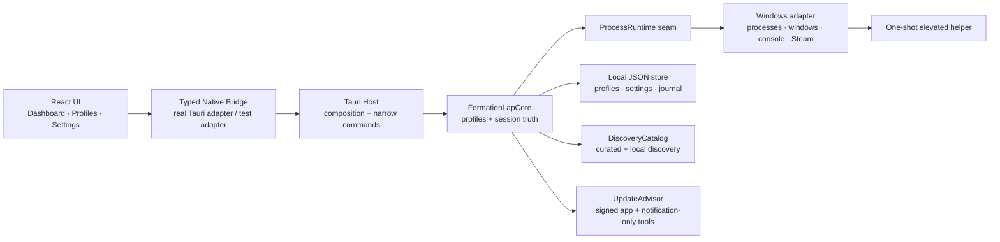
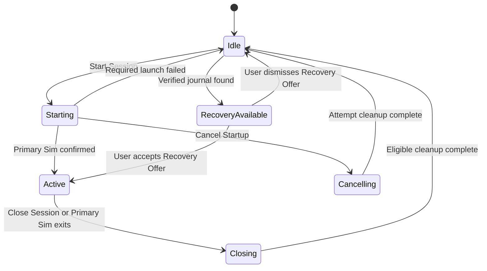

# Formation Lap architecture

## Architectural intent

Formation Lap is organized around deep modules: small interfaces that hide
process ownership, startup ordering, recovery, Steam discovery, update
providers, and Windows privilege details. React presents state and user intent;
it never becomes a second lifecycle engine.

The architecture optimizes for:

- Trustworthy Windows process control.
- Local, inspectable user state.
- Testability through the same interfaces callers use.
- Quiet behavior during a race.
- Small, explicit Tauri capabilities.
- Locality: one place owns each difficult rule.

## System map



## Planned repository shape

```text
/
├── AGENTS.md
├── CONTEXT.md
├── docs/
│   ├── PRODUCT_SPEC.md
│   ├── adr/
│   ├── architecture/
│   │   ├── ARCHITECTURE.md
│   │   ├── BUILD_PLAN.md
│   │   └── PROGRESS.md
│   └── design/
├── catalog/
│   ├── sims.json
│   └── applications.json
├── src/                              # React + TypeScript
│   ├── app/
│   ├── features/
│   │   ├── dashboard/
│   │   ├── profiles/
│   │   ├── settings/
│   │   └── diagnostics/
│   ├── native-bridge/
│   ├── ui/
│   └── generated/
├── src-tauri/
│   ├── Cargo.toml                    # Rust workspace and Tauri host
│   ├── capabilities/
│   ├── crates/
│   │   ├── formation-lap-core/
│   │   └── formation-lap-windows/
│   └── src/
│       ├── bin/elevated-helper.rs
│       ├── commands/
│       ├── lib.rs
│       └── main.rs
└── tests/
    └── fixtures/                     # Healthy, slow, hung, and launcher apps
```

Do not create a new crate or frontend package merely to mirror a folder. A new
module must hide meaningful behavior behind an interface or provide a second
adapter at a real seam.

## Deep modules

### FormationLapCore

**Responsibility:** Own all authoritative profile and Session state, enforce
invariants, serialize lifecycle actions, persist the active-session journal,
and produce snapshots and events for callers.

**Interface:**

```rust
snapshot() -> AppSnapshot
execute(command: AppCommand) -> CommandOutcome
subscribe() -> AppEventStream
```

`AppCommand` is a closed, typed enum covering profile changes, Session actions,
and explicit per-application controls. The Tauri host exposes specific commands
to the WebView and maps them to this interface; it must not expose a generic
unvalidated command proxy.

**Hidden implementation:**

- Single-Session invariant.
- Profile lock while active.
- Startup and shutdown sequencing.
- Required/Optional behavior.
- Session ownership and process identity.
- Race-safe event suppression.
- Recovery Offer state.
- Atomic journal changes.

This is the main test seam for lifecycle behavior.

### ProcessRuntime

**Responsibility:** Translate process intent into observable Windows process
behavior without owning Session policy.

**Interface capabilities:**

- Find matching processes and return stable identities.
- Spawn an executable or protocol Launch Recipe.
- Observe exit and responsiveness.
- Request a configured graceful stop.
- Force stop after an already-authorized request.
- Read bounded console output when configured.

**Adapters:**

- Production Windows adapter.
- Scripted adapter used by FormationLapCore behavior tests.
- Real fixture executables used by Windows integration tests.

The seam is real because lifecycle policy must be exercised deterministically
while the Windows implementation must also be verified independently.
The production adapter privately opens one `VerifiedProcessHandle` with every
right required by an action, reads creation time and canonical executable path
from that handle, compares the complete identity, and holds the handle until
the observation, wait, graceful request, or termination finishes. This
deepening does not change the ProcessRuntime interface.

### ProfileLibrary

**Responsibility:** Present valid Racing Profiles while hiding JSON schema
versions, migrations, atomic writes, backups, import/export, and path-repair
diagnostics.

**Interface capabilities:**

- List and load profiles.
- Save one validated profile.
- Delete one profile with recoverable backup.
- Import or export one portable profile document.
- Retain each trusted source path independently from document content.
- Repair invalid legacy IDs into UUID-named documents while preserving backups.
- Keep newly imported executable configuration in Needs Review until approved.

Tests use a real temporary directory. Do not add a filesystem port solely for
mocking.

### DiscoveryCatalog

**Responsibility:** Merge the signed Curated Catalog with targeted local
discovery and Manual Entries.

**Interface capabilities:**

- Discover installed Primary Sims.
- Discover recognized Supporting Applications.
- Return compatibility-ranked suggestions for one sim.
- Resolve local icons and report unresolved paths.

It owns Steam manifest parsing, Windows installed-app inspection, known
locations, and catalog matching. It never performs a full-drive scan.

### UpdateAdvisor

**Responsibility:** Report update knowledge without mutating third-party
applications and without interrupting an Active Session.

**Interface capabilities:**

- Check Formation Lap's Stable or opt-in prerelease channel.
- Check configured third-party Update Providers.
- Return Current, Update Available, or Unknown.

Provider adapters include GitHub Releases, Winget, and official-page links.
The official Formation Lap Stable feed is the latest signed release in
`Williem3/FormationLap`; the opt-in prerelease channel uses bounded host-side
prerelease discovery in the same repository. A `v0.x` technical preview lacks
Windows Authenticode but still requires the embedded Tauri trust root and a
valid updater signature. Network activity is disabled while race-safe behavior
applies. Update results are exposed only after the Session returns to Idle.

### UpdateCoordinator

**Responsibility:** Own asynchronous online checks and first-party installation
as native activities serialized with FormationLapCore Session transitions.

**Interface capabilities:**

- `check(trigger)` for explicit or opted-in scheduled checks.
- `install(checked_version)` under an exclusive core-owned activity lease.
- `cancel_for_session_start()` and await provider completion or cancellation.

UpdateCoordinator owns tasks, cancellation, URL/redirect/size constraints, and
the checked-version token. UpdateAdvisor continues to model update knowledge;
React only sends intent and renders snapshots. A new installation has automatic
checks off, while an explicitly persisted existing `true` is preserved.

### PrivilegeBroker

**Responsibility:** Validate and execute the smallest possible elevated batch.

The normal adapter verifies the fixed sibling helper's release identity, creates
a current-user-only named pipe, and launches the helper through UAC. The helper
derives the pipe server PID from Windows and verifies the same user and
interactive Session, exact canonical sibling `formation-lap.exe`, release
identity, protocol version, and nonce before typed request validation. Signed
Beta/Stable artifacts require WinVerifyTrust and signer-certificate equality.
Unsigned previews require a release-identity-key-signed manifest plus exact
main/helper hashes. Tests use an in-process adapter that records validated
operations. The helper does not accept arbitrary shell text and cannot remain
resident.

### NativeBridge

**Responsibility:** Give React a typed interface to Formation Lap without
leaking Tauri details throughout the UI.

**Adapters:**

- Tauri invoke/event adapter in production.
- In-memory behavior adapter for React tests and Storybook-like development.

Rust DTOs are the source of truth. TypeScript types and invoke wrappers are
generated, committed, and checked for staleness in CI.

## Tauri command seam

The WebView receives narrow commands such as:

- `get_app_snapshot`
- `save_profile`
- `delete_profile`
- `import_profile`
- `approve_profile`
- `export_profile`
- `start_session`
- `cancel_startup`
- `close_session`
- `control_application`
- `discover_applications`
- `check_updates`
- `install_formation_lap_update`

Each command accepts a typed payload, validates it in Rust, and delegates to a
deep module. Commands contain no lifecycle rules.

The frontend is never granted generic shell, filesystem, process, or HTTP
capabilities.

## Session state model



FormationLapCore serializes state transitions through one async command loop.
Concurrent UI requests cannot create two Active Sessions or race a close against
a restart.

## Process identity and ownership

Never identify a Session-owned Process by PID alone. A stable identity includes:

- PID.
- Process creation time.
- Expected executable identity or canonical path where available.
- The profile entry that initiated it.

The Windows adapter may collect richer metadata, but policy is based on the
stable identity returned through the ProcessRuntime seam.

Pre-existing Processes are observed but never adopted for automatic cleanup.
Explicit user actions require a separate confirmation path.
Direct recipes use the canonical source path as executable identity. Launcher
and Steam recipes may name an optional canonical monitored executable path. A
filename-only match can be displayed, but FormationLapCore must classify it as
Pre-existing until Test Game Launch learns a path and the user confirms it.

## Persistence

Formation Lap stores new state under the per-user local application-data
directory:

```text
Formation Lap/
├── settings.json
├── catalog-overrides.json
├── active-session.json
├── profiles/
│   └── <profile-id>.json
├── backups/
└── logs/
```

Persistence rules:

- Every document includes a schema version.
- Writes use a temporary file in the destination directory followed by atomic
  replacement.
- The prior valid document is retained as a bounded backup.
- Failed migration never overwrites the last valid document.
- Session journal writes happen as ownership changes, not only on clean exit.
- Exported profiles omit transient process identities and diagnostic state.
- On first upgraded launch, an empty local store may be populated only by
  copying a roaming store into a temporary local directory, validating every
  document, and atomically activating it. The roaming copy remains a backup;
  conflicting stores are never merged.
- Profile save/delete paths come from ProfileLibrary's trusted inventory, never
  an untrusted document ID. UUID IDs must match filenames.

## Windows implementation

The Windows adapter is responsible for:

- Direct executable launch without shell interpretation.
- Optional visible or hidden consoles.
- Console process groups and graceful interrupt delivery.
- Window enumeration and close requests.
- Repeated window responsiveness checks.
- Exit observation.
- One verified Process handle held through each action.
- Steam library and process discovery.
- Protocol launch through validated Steam URIs.
- Local executable icon extraction.

The adapter returns observations and typed errors. It does not decide whether a
failure blocks the game or whether a process should be automatically closed.

## Elevated helper protocol

The one-shot helper request must contain:

- Protocol version.
- Parent Formation Lap process identity.
- Single-use nonce.
- Current-user identity.
- A bounded list of typed launch or termination operations.
- Canonical executable targets and direct argument arrays.

Elevated operations are released at their saved sequence positions. Only
adjacent elevated entries share a transaction. After each launch, the helper
returns a stable identity and waits for an ownership acknowledgement; the core
journals ownership before acknowledging. Missing acknowledgement causes the
helper to stop the just-launched Process before it exits or continues.

The helper authenticates its caller and validates the complete request before
doing work, reports structured results through a current-user-only IPC channel,
and exits. It exposes no general shell, file-write, or network operation.

## Security model

- Load only bundled frontend assets in the WebView.
- Deny remote WebView navigation.
- Open validated external HTTPS links through the native opener.
- Use explicit Tauri capability files and least privilege.
- Validate every payload again in Rust.
- Canonicalize executable paths before launch or privileged use.
- Pass arguments directly; do not concatenate shell command strings.
- Keep Update Provider domains and schemes allowlisted.
- Never transmit profiles, process lists, logs, or installed-app inventories to
  a Formation Lap service.
- Keep all destructive process actions user-initiated or required by an
  explicitly started Session.

## Error model

Errors crossing the Rust/TypeScript seam are structured:

```text
code          stable machine-readable identifier
message       concise user-facing explanation
recovery      optional user action
diagnosticId  optional local-log correlation value
```

Do not expose raw Rust debug output, command lines containing sensitive data, or
unbounded OS error strings to the interface. Full local details belong in the
bounded diagnostic log.

## Test seams

These seams were explicitly approved before implementation:

| Seam                 | What tests observe                                                   | Adapter strategy                              |
| -------------------- | -------------------------------------------------------------------- | --------------------------------------------- |
| FormationLapCore     | Profiles, Session actions, ownership, snapshots, events              | Scripted ProcessRuntime and real temp storage |
| ProcessRuntime       | Actual Windows launch, status, close, console, child-launch behavior | Purpose-built fixture executables             |
| Tauri commands       | Payloads, errors, generated TypeScript compatibility                 | Host integration and stale-generation check   |
| React user interface | Visible profile and Session behavior                                 | In-memory NativeBridge adapter                |

Tests assert behavior through these interfaces. They do not mock internal
modules, inspect private state, or assert internal call counts.

## Release architecture

- `pnpm-lock.yaml` and `Cargo.lock` are committed.
- Dependency versions and CI actions are pinned.
- CI runs formatting, linting, type checking, Rust tests, React tests, Windows
  integration fixtures, contract generation checks, dependency audits, and a
  packaged-app smoke test.
- The manually dispatched technical-preview workflow accepts only existing
  `v0.x` tags and publishes an unsigned-Authenticode GitHub prerelease with a
  Tauri updater signature, explicit disclosure, checksums, SBOM, license
  report, and provenance.
- The Stable/Beta release workflow remains separate and fail-closed. It creates
  Authenticode-signed Windows installers, Tauri update signatures, checksums,
  SBOM, license report, and provenance.
- Version one and later public artifacts require Authenticode. Development
  builds and approved `v0.x` technical previews may remain unsigned only under
  their respective non-public or explicitly disclosed contracts.

## Architectural guardrails

Future work must preserve these rules:

1. React renders state; FormationLapCore owns lifecycle truth.
2. Tauri commands adapt; they do not contain policy.
3. ProcessRuntime observes Windows; it does not decide Session behavior.
4. Automatic cleanup requires Session ownership.
5. Elevated work remains one-shot and typed.
6. Third-party updates remain notification-only.
7. The Curated Catalog changes only in signed application releases.
8. All user state remains local and inspectable.
9. No new seam without two justified adapters.
10. No milestone is complete without its documented exit evidence.
