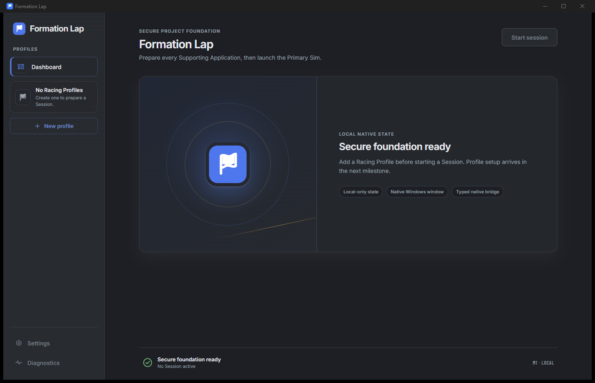

# M1 — Secure project foundation evidence

Completed: 2026-07-23

## Toolchain and install

- Node.js `25.8.0`
- pnpm `10.33.0`, pinned in `package.json`
- Rust/Cargo `1.97.1`, pinned in `rust-toolchain.toml`
- Tauri CLI `2.11.4`, Tauri Rust crate `2.11.5`, and Tauri API `2.11.1`
- `pnpm-lock.yaml` and `src-tauri/Cargo.lock` are present.
- `pnpm.cmd install --frozen-lockfile` passed with the lockfile unchanged.
- The exFAT workspace cannot create symlinks or Cargo hard links. `.npmrc`
  selects pnpm's supported hoisted linker; Cargo falls back to copying
  incremental-cache files and completes successfully.

Clean-checkout commands and prerequisites are documented in
[`../../../README.md`](../../../README.md) and
[`../../DEVELOPMENT.md`](../../DEVELOPMENT.md).

## Red-green evidence

Initial React tests failed because `App` and `InMemoryNativeBridge` did not
exist. The initial Rust seam test failed because `get_app_snapshot` did not
exist. After implementing only those public interfaces:

- Vitest: 2 files, 3 tests passed.
- Cargo: 2 navigation-guard unit tests and 1 public snapshot-command integration
  test passed.

## Verification transcript

All commands exited successfully:

```text
pnpm.cmd verify
  prettier: passed
  eslint: passed
  strict TypeScript: passed
  vitest: 2 files / 3 tests passed
  generated contract check: unchanged
  capability audit: passed

cargo fmt --manifest-path src-tauri/Cargo.toml --all -- --check
cargo clippy --manifest-path src-tauri/Cargo.toml --all-targets --all-features -- -D warnings
cargo test --manifest-path src-tauri/Cargo.toml
pnpm.cmd build
```

The initial immutable-SHA Windows workflow is
[`../../../.github/workflows/ci.yml`](../../../.github/workflows/ci.yml). At M1
verification time the workspace had no prior Git history or configured remote,
so M1 uses the allowed local-command transcript rather than claiming a hosted CI
run.

## Native window and bundle

`pnpm.cmd tauri dev --no-watch` opened a responsive window titled
**Formation Lap** and successfully loaded the Rust snapshot through the empty
built-in-permission capability. The screenshot was captured from that native
window at a 1440 × 900 WebView viewport with Windows device scale `1.5`.



Comparison with the approved Dashboard and UI-kit references:

- native Windows title bar and single main window are preserved;
- Carbon/Fog/Lap Blue dark tokens, bundled Inter/Barlow typography, sidebar
  hierarchy, focus treatment, and status icon plus text match the UI contract;
- the empty state uses the generic local fallback icon and presents no fake app
  data;
- Start Session and later-milestone navigation remain visibly disabled;
- no Formation Rail appears because no real Startup Sequence exists yet;
- reduced-motion and light/dark/system theme primitives are present.

`pnpm.cmd tauri build --debug --bundles nsis` produced the unsigned per-user
debug installer:

```text
src-tauri/target/debug/bundle/nsis/Formation Lap_0.1.0_x64-setup.exe
size: 2,728,445 bytes
SHA-256: BEC56E21C79F4C4717FD863787344721584F0C148AB574BCFCD9B8415BA8B594
```

The installer remains a local build artifact under the ignored Cargo target
directory.

## Capability evidence

[`../../security/M1_CAPABILITY_AUDIT.md`](../../security/M1_CAPABILITY_AUDIT.md)
records the audited boundary. `pnpm.cmd security:audit` confirmed:

- one local `main` window;
- zero Tauri core/plugin permissions;
- one narrow application command, `get_app_snapshot`;
- no shell, filesystem, process, opener, upload, WebSocket, or HTTP plugin;
- production network access limited to Tauri IPC, with Vite loopback
  connections isolated to the development CSP;
- remote navigation rejection in Rust;
- restrictive CSP with no remote wildcard.
